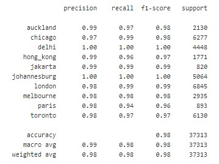

# Predict-english-speaking-region-of-origin-by-analyzing-tweets

Predict the region of origin of an english-speaking tweet author by analyzing tweet content using machine learning classifier

# Project description

In this short project, the objective is to do a content-based classification of english-speaking regions, based on tweets.
During training, the model extracts english language variations specific to the region/origin of the tweets and uses it to determine geographical origin of the author during inference. This is possible because the structural parts of language contain information about authorship and style.

# Dataset uset

The dataset used a over 370k tweets from Twitter with authors belonging to 10 different regions. The regions are labelled using the capital city. All tweets are in english and therefore use english language specificities based on the region.

# Classification

A simple SVM classifier is used. The key is to extract linguistic specificities from each region. The project uses tf-idf weighting to extract the key linguistic specificities and reduce the influence of english commonalities accross the dataset. This is done using a tf-idf vectorizer.

Language carries information about who we are. Regardless of the subject, different regions will have different style or dialect. English grammar gives lots of different choices for saying the exact same thing. The examples below mean the same thing. But the linguistic form is a bit different for each sentence. The content words are mostly the same across the sentences: go, puddles, bike, cycle, work, commute. But the other words, the function words, change from one sentence to the next.

- (1)  I go around puddles when I bike to work.
- (2)  I avoid puddles when biking to work.
- (3)  I avoid puddles on my commute.
- (4)  I hate cycling through puddles on the way to work.
- (5)  Puddles are something I always go around when I am commuting.

These are called alternations. The coice of these alternations is not random or arbitrary. It is based on things like geographic dialects or social patterns. These differences can be used to predict information about the text’s author: gender, dialect, native language, and sometimes even age and class. This information is contained in the grammatical structure of the document. And Machine learning can learn and detect these alternations in the written language. In this project, the dialect or region of origin is leveraged.

# Results

The classification performance is very good on all regions. Lowest performance achieved with France (Paris) with F1-score of 0.96. This could be explained by the fact that this is not an english-speaking country and therefore features could be weaker and/or by the fact that it is one of two least represented labels in the dataset with Indonesia. Yet F1 score on Indonesia, another non-english speaking country,  reachs 0.99.
Overall accuracy of 98% accross all regions.

# Next
- preprocess text to improve performance and robustness
- 
